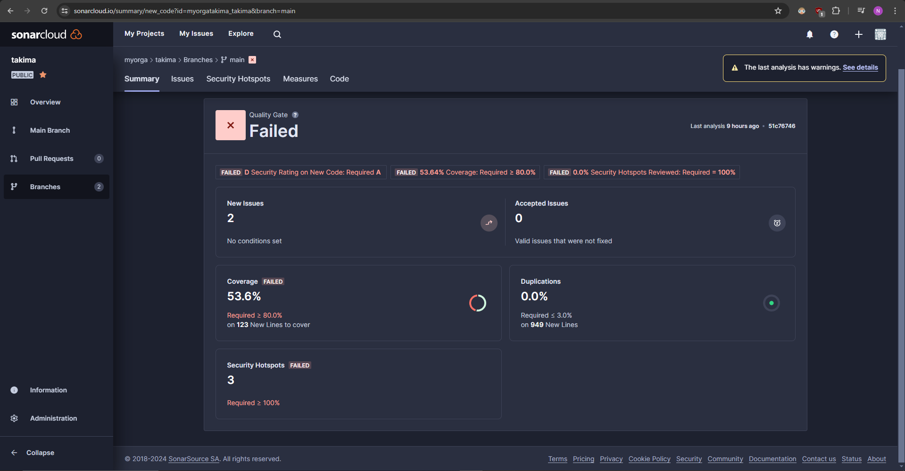

# TP 2 : GitHub Actions

### 2-1 What are Testcontainers?

Test containers are a part of an open-source library that provides lightweight, throwaway instances of common databases, message brokers, web browsers, or anything else that can run in a Docker container. 

They are primarily used for **unit testing** with real dependencies, they ensure that our tests run in an **isolated environment**, which is useful for integration testing.

In this context, Testcontainers is used to spin up a PostgreSQL database container to verify the correct insertion and retrieval of data during the tests.


### 2-2 Document your Github Actions configurations.

#### Workflow 1 : `test-backend.yml`

This workflow is responsible for testing the backend application every time code is pushed to the main or develop branches.

```
name: Test Backend

on:
  push:
    branches: [ main, develop ]
  pull_request:
    branches: [ main, develop ]

jobs:
  test-backend:
    runs-on: ubuntu-22.04

    steps:
      - name: Checkout code
        uses: actions/checkout@v2.5.0

      - name: Set up JDK 17
        uses: actions/setup-java@v3
        with:
          java-version: '17'
          distribution: 'adopt'

      - name: Build and test with Maven
        run: |
          cd api/simple-api-student-main
          mvn clean verify
```

1. Trigger Events:

This workflow triggers on pushes and pull requests to the main and develop branches.

2. Job:

* Runs on Ubuntu 22.04.

* Checkout code: Uses the `actions/checkout@v2.5.0` action to pull the code from the repository.

* Set up JDK 17: Uses the `actions/setup-java@v3` action to set up Java Development Kit version 17 with the adopt distribution.

* Build and test with Maven: Changes the directory to api/simple-api-student-main and runs the `mvn clean verify` command to clean, build, and test the project.


#### Workflow 2 : `build-and-push-docker-image.yml`


This workflow is responsible for building and pushing Docker images to Docker Hub. 
It is triggered only when the `Test Backend` workflow completes successfully.

```
name: Build and Push Docker Image

on:
  workflow_run:
    workflows: ["CI devops 2024"]
    types:
      - completed

jobs:
  build-and-push-docker-image:
    if: github.event.workflow_run.conclusion == 'success'
    runs-on: ubuntu-22.04

    steps:
      - name: Checkout code
        uses: actions/checkout@v2.5.0

      - name: Log in to Docker Hub
        uses: docker/login-action@v2
        with:
          username: ${{ secrets.DOCKERHUB_USERNAME }}
          password: ${{ secrets.DOCKERHUB_TOKEN }}

      - name: Build and push backend image
        uses: docker/build-push-action@v3
        with:
          context: ./api/simple-api-student-main
          tags: ${{ secrets.DOCKERHUB_USERNAME }}/tp-devops-simple-api:${{ github.sha }}

      - name: Build and push database image
        uses: docker/build-push-action@v3
        with:
          context: ./db
          tags: ${{ secrets.DOCKERHUB_USERNAME }}/tp-devops-database:${{ github.sha }}
          push: ${{ github.ref == 'refs/heads/main' }}

      - name: Build and push httpd image
        uses: docker/build-push-action@v3
        with:
          context: ./front
          tags: ${{ secrets.DOCKERHUB_USERNAME }}/tp-devops-httpd:${{ github.sha }}
```


1. Trigger Events:

This workflow is triggered upon the completion of the `Test Backend` workflow.

2. Job: build-and-push-docker-image:

* Checkout code: Use actions/checkout@v2.5.0 to fetch the repository code.

* Log in to Docker Hub: Log in to Docker Hub using docker/login-action@v2 with credentials stored in GitHub secrets.

* Build and push backend image: Build and push the Docker image for the backend. The image is tagged with the commit SHA.

* Build and push database image: Build and push the Docker image for the database, also tagged with the commit SHA.

* Build and push httpd image: Build and push the Docker image for the HTTP server, also tagged with the commit SHA.

* By using ${{ github.sha }}, we ensure that each Docker image is tagged with a unique identifier corresponding to the specific commit, making it easier to track versions and debug issues, rather than tagging with a default `latest`.

## Sonar Cloud


### GitHub Actions Workflow updated 


```
      - name: Build and test with Maven
        run: |
          cd api/simple-api-student-main
          mvn -B verify sonar:sonar \
            -Dsonar.projectKey=myorgatakima_takima \
            -Dsonar.organization=myorgatakima \
            -Dsonar.host.url=https://sonarcloud.io \
            -Dsonar.login=${{ secrets.SONAR_TOKEN }} \
            --file pom.xml
```

* SonarCloud Analysis Command: The mvn -B verify sonar:sonar command runs Maven's verify goal and the SonarCloud analysis.

- `Dsonar.projectKey=myorgatakima_takima`: Specifies the SonarCloud project key.
- `Dsonar.organization=myorgatakima`: Specifies the SonarCloud organization key.
- `Dsonar.host.url=https://sonarcloud.io`: Specifies the SonarCloud server URL.
- `Dsonar.login=${{ secrets.SONAR_TOKEN }}`: Authenticates with SonarCloud using the secure token stored in GitHub secrets.
- `--file pom.xml`: Specifies the path to the pom.xml file.

After pushing changes to your repository, the GitHub Actions workflow should trigger and perform the SonarCloud analysis. 

### Quality Gate

We use SonarCloud to analyze the code quality and ensure maintainability and security. The analysis is triggered during the CI pipeline. Here are the results from our latest analysis:




